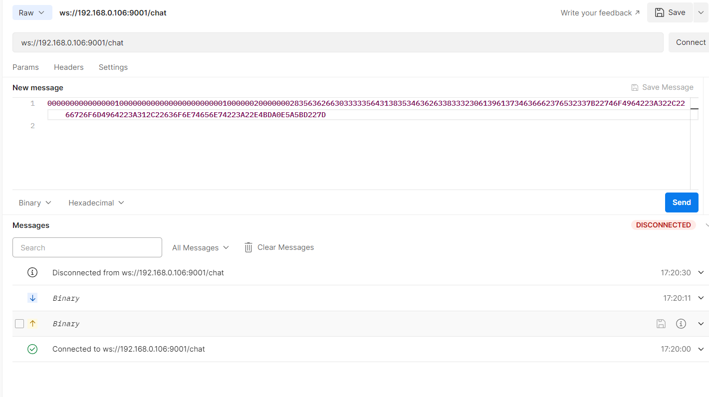
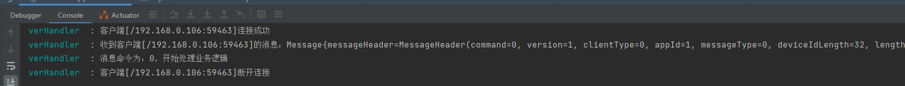

# QF-IM 💬
**强的飞起** - 基于现代技术栈构建的高性能、可扩展的即时通讯系统

  
  
  
  
  

## 技术栈

| 技术组件 | 版本 | 用途说明 |
|---------|------|----------|
| **JDK 17** | 17+ | 利用最新LTS版本的性能优势和语言特性，Records、Pattern Matching等 |
| **Spring Boot** | 3.x | 现代化应用框架，快速开发企业级应用 |
| **Nacos** | 2.x | 服务注册发现、配置管理、服务治理 |
| **RocketMQ** | 5.0 | 高吞吐消息队列，保障消息可靠投递和顺序性 |
| **MySQL** | 8.0 | 关系型数据存储，用户/群组/关系等结构化数据 |
| **Elasticsearch** | 8.x | 消息全文检索和历史记录查询，分布式搜索 |
| **Redis** | 7.0 | 缓存、会话管理、在线状态、发布订阅 |
| **Netty** | 4.x | 高性能网络通信框架，支撑百万级并发连接 |

## 项目结构
| 模块             | 功能说明    |
|----------------|---------|
| **im-common**  | 公共服务    |
| **im-biz**     | 业务服务    |
| **im-server**  | netty服务 |
                   
## 测试

